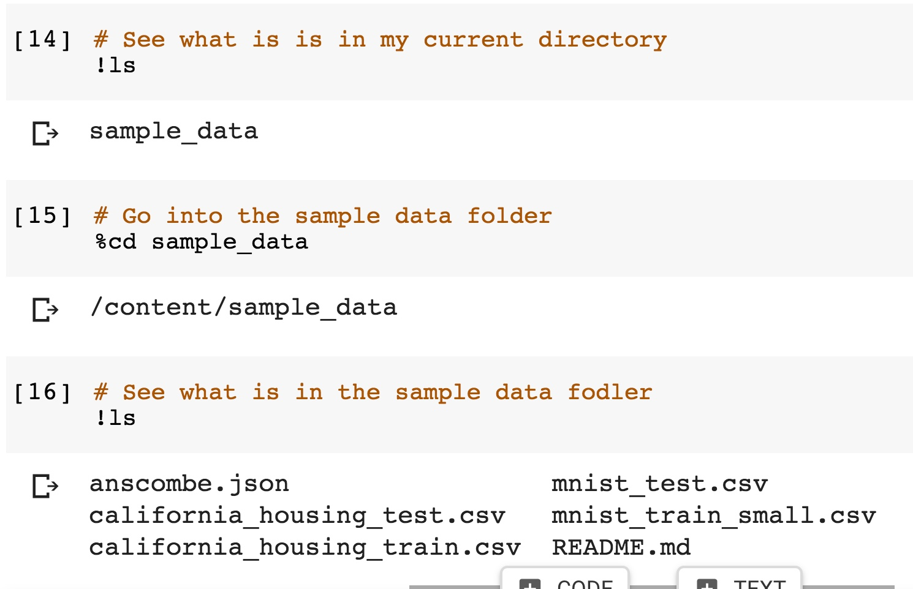

# Line Counter

One useful python script that you can now build is a script to count the number of lines in a file.  In this part of the class, we will build a line counter using Google Colab notebook and the skills we have learned so far.  I am not going to provide you witht he notebook as you should now have to work from.

###  Choosing a file

We are going to begin by exploring what files are available to us.  In a new Colab notebook, use the ls command to see what available folders and files are in your working directory

- `!ls` shows the folders and files in your current directory
- `%cd folder_name` allows you to enter into a different directory that you are currently in!


After doing this myself, I had the following output.  Yours should be similar if not exactly the same



Now that I know what is in my current folder, I am going to pick the file `'california_housing_test.csv'`

### Counting the lines in the file

Using the same code that we have used previously in this lecture, is it possible to count the number of lines in the file?  Try it yourself, and my code is below!


```python
#  Function takes in the file name
def count_lines(filename):

  # Initialize the count
  count = 0

  # Open the file
  with open(filename,'r') as f:

    # Print each line
    for line in f:

      # add to count
      count += 1

    f.close()
  return count

# Call the function
count_lines('california_housing_test.csv')

```
